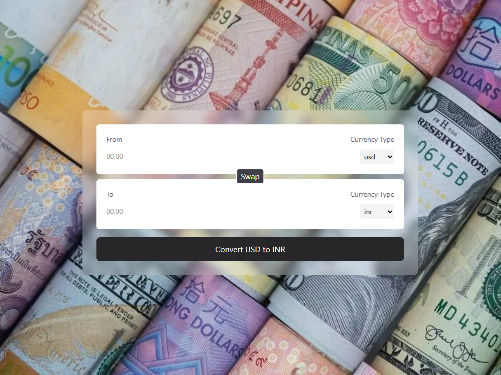

# 💱 React Currency Converter

A simple and responsive currency converter built with **React** and **Tailwind CSS**, created to practice using **custom hooks**.

---

## 📌 Features

- 🔁 Convert from one currency to another in real-time
- 🔄 Swap "From" and "To" currencies
- 🌐 Fetches exchange rates dynamically from a JSON API
- 🔍 Clean UI with `Tailwind CSS`
- 🧠 Uses a custom `useCurrency` hook to manage currency data fetching

---

## 🧠 Purpose

This project was created to **learn and practice custom React hooks** — specifically:

- Separating logic for data fetching
- Making components more reusable and cleaner
- React `useEffect`, `useState`, and controlled components

---

## 🧩 Tech Stack

- **React** (Vite)
- **Tailwind CSS**
- **Axios**
- **Custom Hooks**

---

## ⚙️ Getting Started

### 1. Clone the repo

```bash
git clone https://github.com/viveksahux/Currency-Converter.git
cd react-currency-converter
```
### 2. Install dependencies
```bash
npm install
```

### 3. Setup .env   
Create a .env file in the root:
```env
VITE_API_URL=https://latest.currency-api.pages.dev/v1/currencies
```

### 4. Run the app
```bash
npm run dev
```

## 📸 Screenshot

> This project is just for fun and learning

## Credits
This project is based on a tutorial by [Hitesh Choudhary](https://github.com/hiteshchoudhary/chai-aur-react/tree/main/06currencyConvertor).

